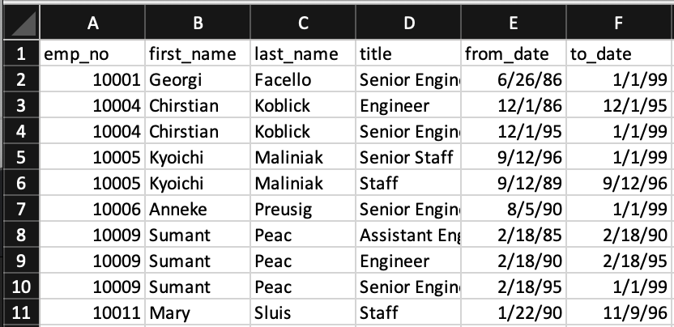
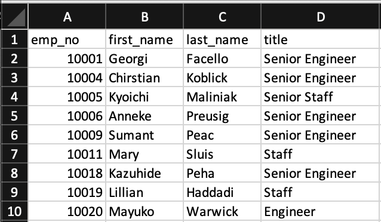
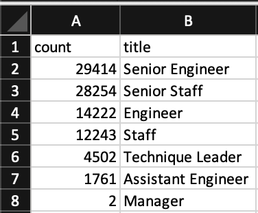
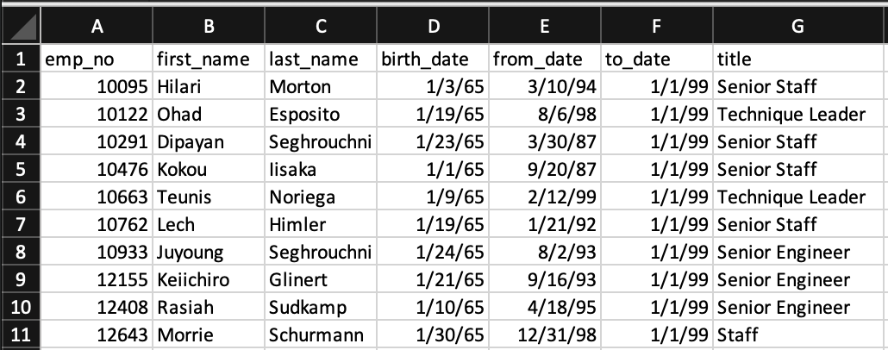

# Pewlett Hackard Analysis
Building an employee database for Hewlitt Packard using SQL

## Overview
Pewlett Hackard (PH) is a large technology services company that has been around for decades. Many of the employees that joined in the early days are now preparing for retirement, and PH needs to know how many of these employees will be retiring in the next few years so that they can prepare for the vacanies that will be left. 

Currently, PH uses excel files to keep track of employees and departments, but this outdated system makes it difficult for human resources to identify exactly how many people will soon be retiring and from which departments. The goal of this analysis is to transform these excel files into an employee database using SQL so that HR can answer the following: 

1.  Who will be retiring in the next few years?
2.  How many positions will PH need to fill?

## Results
In order to build a database from the existing files, we first created an entity relationship diagram (ERD) to identify the links that exist between each file:

 
Using this ERD, we know exactly which files to draw the desired information from, and how it can be joined together to answer our specific questions. 

### 1. The Number of Retiring Employees by Title

* We first extracted a list of employees born between 1952 and 1955, knowing that these employees are nearing retirement age and qualify for retirement packages. We also included their corresponding titles so that we can later quantify the number of anticipated vacancies by title, allowing human resources to begin an informed and targeted recruitment search. 

    

* The issue with the above table is that some employees changed titles (either from promotion or from changing departments), meaning that their name will show up more than once. This will end up overestimating the number of employees planning to retire. To resolve this issue, we next generated a new table with filtered results to show only the most recent title of the retirement-eligible employee. 

    

    Here, we can see that each employee shows up only once, ensuring that our estimate of retiring employees is accurate. 

* Next, we used our table of unique titles to quantify the number of expected vacanies by title. This table is especially informative because it will inform PH where to target their hiring search, and how many people for each position will need to be hired. 

    

    We can see from this table that most retirement-eligible employees are Senior Engineers and Senior Staff, followed next by Engineers and Staff, then by Technique Leaders and Assistant Engineers, and lastly by Managers. PH can either decide to look externally for Senior Eningeers and Senior Staff, or focus on promoting current Engineers and Staff so that the bulk of the hiring is targeted toward recruiting mid and entry level Engineers and Staff. 

### 2. The Employees Eligible for the Mentoship Program

* If internal promotion is the focus to fill Senior-level positions at PH, then it may make more sense to keep some of these retirement-eligible employees as part-time mentors for current Engineers and Staff. This will reduce the amount of time and resources that go into training new employees. PH refers to this as their Mentorship Program. 
    
    To identify current employees eligbile to be mentors, we extracted employess born in 1965 and created a table containing the employee's number, first and last name, from date (date that they were hired for or promoted into the position) and title. 

    

    PH can use this information to identify staff members that are nearing retirement, and reach out to them to gauge their interest in mentoring new and current employees. 

## Summary

In all, PH will need to fill a total of 90,398 positions in the coming years, more than half of which are senior-level Engineers and Staff. 

There are a total of 1,549 mentorship-eligible employees based on our query. That would mean that if every mentorship-eligible employee accepted the role, they would be mentoring 58 employees each on average. This is unrealistic, and there are many employees that may choose not to be mentors, meaning that the average mentor:mentee ratio will likely be higher. 

In order to increase the number of eligible mentors, another query can be performed that expands the date of birth to at least a 5 year range instead of a 1 year range. If there are about 1,500 mentorship-eligible employees per year in the birth date range, then the mentor:mentee ratio would drop to approximately 11:1, which is far more reasonable than 58:1. 

Additionally, the list of eligible mentors contains all titles, but we know from our analysis that most upcoming vacancies will be senior-level positions. It would be helpful to peform another query that extracts only senior-level eligible mentors. This would mean that we would likely need to expand the birth date range again, but it would in turn provide a more specific mentorship program that would better suit the needs of the changing company. 
